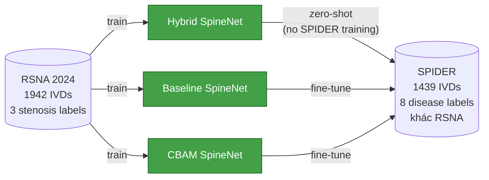
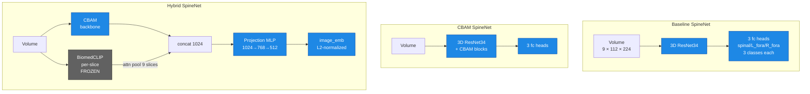
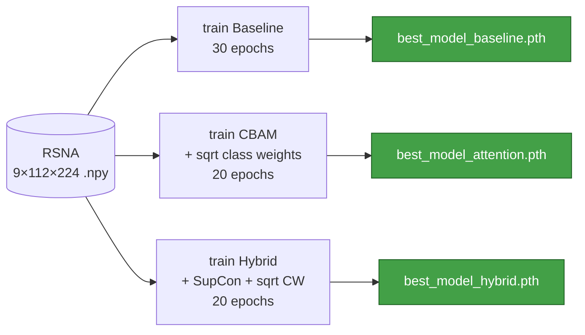
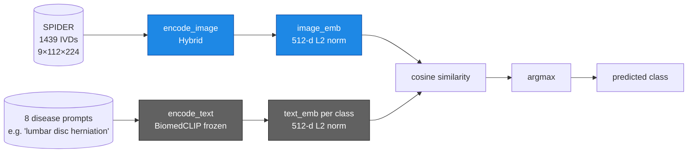
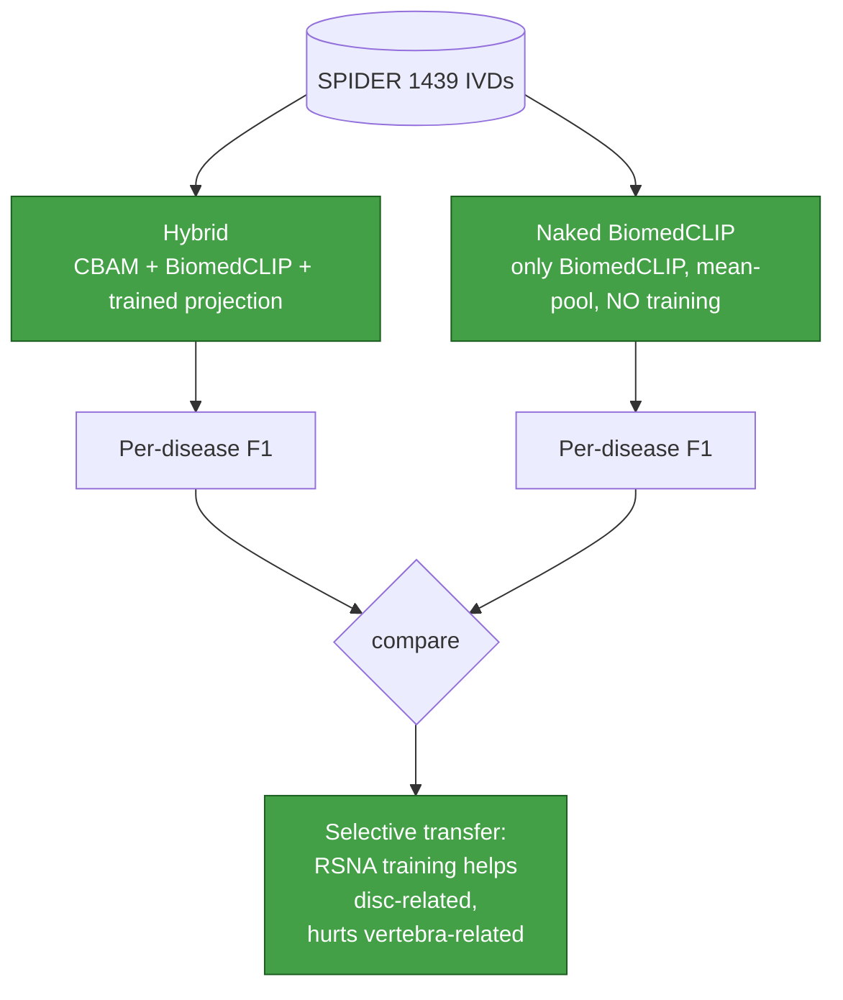
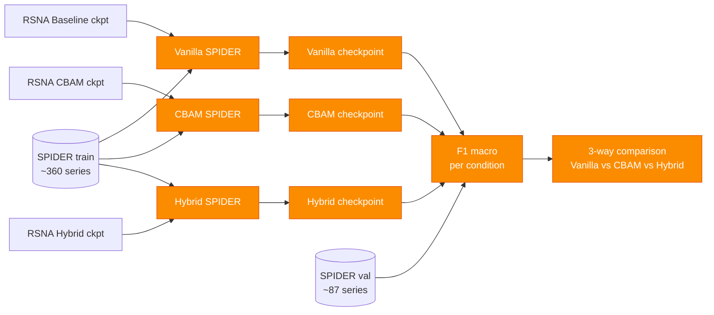
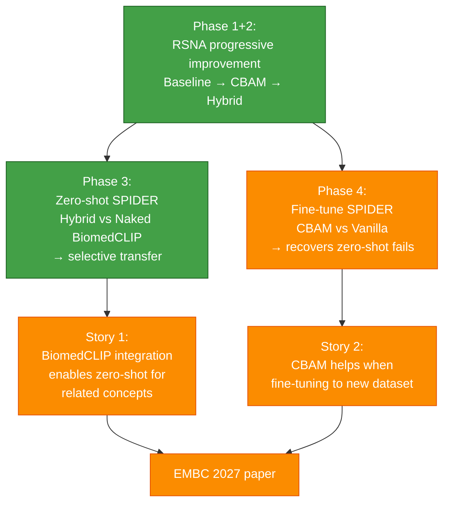

# SpineNetV2 + BiomedCLIP — Project Overview

> **Mục đích**: high-level view của toàn bộ pipeline để dễ theo dõi tổng thể, không đi vào số liệu chi tiết. Mỗi phase có 1 diagram + 1-2 dòng giải thích + status.
>
> Phù hợp để forward thầy review. Số liệu chi tiết xem trong các report riêng:
> - `experiments/fresh_cbam/RESULTS_SUMMARY.md` (Phase 1+2 RSNA results)
> - `experiments/paper_results/spider_zeroshot/SUMMARY_FOR_ADVISOR.md` (Phase 3 SPIDER zero-shot)
> - (Phase 4 chưa có)

## Color legend (Mermaid)

| Color | Meaning |
|---|---|
| 🟢 green | Done |
| 🟠 orange | TODO |
| 🟡 yellow | Pretrained / loaded from previous phase |
| 🔵 blue | Trained in this phase |
| ⚫ dark gray | Frozen pretrained (BiomedCLIP) |

## Big picture

Mở rộng SpineNetV2 (Windsor et al. 2024) với 2 cải tiến:
1. **CBAM attention** thêm vào 3D ResNet34 backbone → cải thiện grading trên RSNA
2. **Hybrid integration** (CBAM backbone + frozen BiomedCLIP) → enable **zero-shot label extension** sang SPIDER mà không cần re-train



## Phase 1 + 2 — Train 3 RSNA models ✅ DONE

**Goal**: produce 3 checkpoints to show progressive improvement on RSNA validation set.

**Status**: All 3 trained. Best Hybrid Avg Severe F1 = 0.353.

### High-level architectures

> 📎 **Hybrid architecture chi tiết** (3 sources):
> - [`experiments/paper_results/HIGH_LEVEL_ARCHITECTURE.md`](experiments/paper_results/HIGH_LEVEL_ARCHITECTURE.md) — Mermaid diagram + giải thích từng phần + 2 feedback của thầy đã address
> - [`experiments/hybrid_architecture.png`](experiments/hybrid_architecture.png) — visual PNG full diagram
> - [`HYBRID_TRAINING_GUIDE.md`](HYBRID_TRAINING_GUIDE.md) — forward pass text step-by-step + hyperparameters
>
> 📎 **Code**: [`spinenet/models/grading_hybrid.py`](spinenet/models/grading_hybrid.py)



### Pipeline



## Phase 3 — Zero-shot SPIDER evaluation ✅ DONE

**Goal**: kiểm tra Hybrid (chỉ train trên RSNA) có thể predict các label SPIDER chưa từng thấy hay không, **không fine-tune**.

**Status**: Hybrid + Naked BiomedCLIP ablation đã chạy. Finding: selective transfer (Hybrid thắng disc-related, thua vertebra-related).

### Zero-shot pipeline



### Ablation: Hybrid vs Naked BiomedCLIP



## Phase 4 — SPIDER transfer learning ⏳ TODO

**Goal**: 3-way comparison trên SPIDER fine-tune để chứng minh (a) CBAM > Vanilla, (b) BiomedCLIP integration giữ được zero-shot capability mà không hy sinh accuracy nhiều, (c) fine-tune cứu được Phase 3 failure modes.

**Status**: code đang chuẩn bị, run trên Vast.ai (~7-8h GPU cho 3 runs).

### 3 model variants

| # | Model | Output mechanism | Init từ | Zero-shot sau Phase 4? |
|---|---|---|---|---|
| 1 | **Vanilla SPIDER** | 4 hardcoded fc heads | RSNA Baseline | ❌ |
| 2 | **CBAM SPIDER**    | 4 hardcoded fc heads | RSNA CBAM | ❌ |
| 3 | **Hybrid SPIDER**  | Cosine sim với text prompts | RSNA Hybrid | ✅ |

### Architecture

```mermaid
flowchart TD
    subgraph BL["1. Vanilla SPIDER"]
        IB[Volume] --> RB[3D ResNet34<br/>load from RSNA Baseline]
        RB --> HB["4 hardcoded heads<br/>random init"]
    end

    subgraph CB["2. CBAM SPIDER"]
        IC[Volume] --> RC[3D ResNet34 + CBAM<br/>load from RSNA CBAM]
        RC --> HC["4 hardcoded heads<br/>random init"]
    end

    subgraph HY["3. Hybrid SPIDER (preserves zero-shot)"]
        IH[Volume] --> RH[CBAM backbone<br/>load from RSNA Hybrid]
        IH --> BH[BiomedCLIP per-slice<br/>frozen]
        RH --> CH[concat 1024]
        BH --> CH
        CH --> PH[Projection MLP<br/>load + fine-tune]
        PH --> EH[image_emb 512]
        EH --> SIM[cosine sim<br/>with SPIDER text prompts]
    end

    classDef pretrained fill:#FBC02D,stroke:#F57F17,color:#000
    classDef trained fill:#1E88E5,stroke:#0D47A1,color:#fff
    classDef frozen fill:#616161,stroke:#212121,color:#fff
    class RB,RC,RH pretrained
    class HB,HC,PH,EH,SIM trained
    class BH frozen
```



### Fine-tune pipeline (3 runs)



### 4 SPIDER conditions chọn cho Phase 4

| # | Label | Type | Anatomy | Phase 3 zero-shot status | Why pick |
|---|---|---|---|---|---|
| 1 | Pfirrmann        | 5-class | disc degeneration       | tied (0.155)        | clinical gold standard |
| 2 | Modic            | 4-class | vertebra inflammation   | FAIL (0.018)        | multiclass + zero-shot fail → fine-tune cứu |
| 3 | Disc_narrowing   | binary  | disc structure          | WIN (0.586)         | sanity: fine-tune ≥ zero-shot? |
| 4 | Spondylolisthesis| binary  | spinal alignment        | FAIL (0.028)        | alignment task → fine-tune cứu |

### Commands trên Vast.ai

```bash
# Run 1: Vanilla SPIDER
python3 train_spider.py --model baseline \
    --rsna-checkpoint checkpoints/best_model.pth \
    --freeze-backbone --epochs 15 --batch-size 16 --lr 1e-3

# Run 2: CBAM SPIDER
python3 train_spider.py --model cbam \
    --rsna-checkpoint checkpoints/best_model_attention.pth \
    --freeze-backbone --epochs 15 --batch-size 16 --lr 1e-3

# Run 3: Hybrid SPIDER (preserves zero-shot)
python3 train_spider_hybrid.py \
    --hybrid-checkpoint checkpoints/hybrid/best_model_hybrid.pth \
    --cbam-checkpoint checkpoints/best_model_attention.pth \
    --epochs 15 --batch-size 16 --lr 1e-4
```

## Phase 5 — Paper writing ⏳ TODO

**Goal**: viết paper EMBC 2027 (Rank-C) với 2 stories complementary.



## Status summary

| Phase | What | Status | Where to find results |
|---|---|---|---|
| 1+2  | Train Baseline + CBAM + Hybrid on RSNA       | ✅ done | `experiments/fresh_cbam/RESULTS_SUMMARY.md` |
| 3    | Zero-shot SPIDER (Hybrid + Naked ablation)   | ✅ done | `experiments/paper_results/spider_zeroshot/SUMMARY_FOR_ADVISOR.md` |
| 4    | Transfer learning SPIDER (4 labels)          | ⏳ TODO | (Vast.ai GPU, ~5h) |
| 5    | Paper writing                                | ⏳ TODO | (after Phase 4) |

## Next concrete actions

1. Commit current code (Phase 3 fixes + reports)
2. Zip SPIDER dataset, upload Drive
3. Modify `grading_spider.py` to support 4 heads (currently 3)
4. Launch Vast.ai instance, restore RSNA checkpoints
5. Run Phase 4: 2 fine-tune runs (Baseline, CBAM)
6. Backup Phase 4 results to local
7. Update this overview with Phase 4 results
