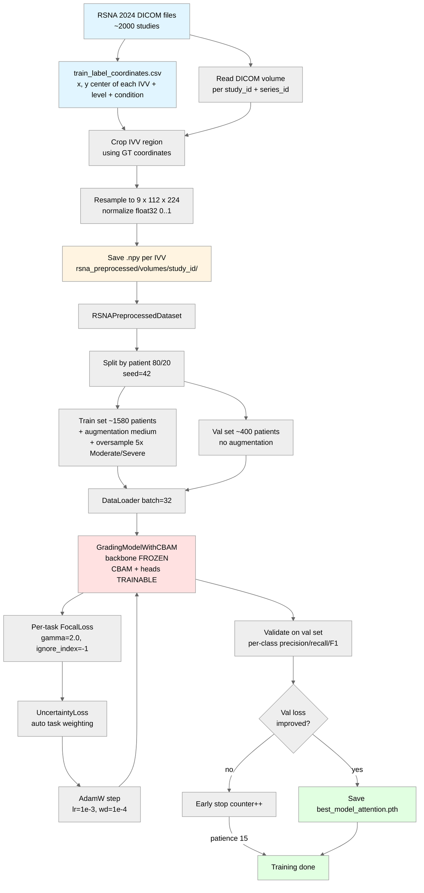
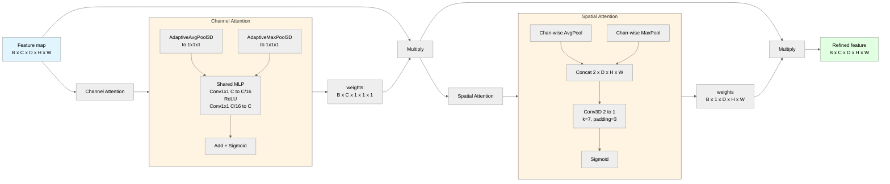
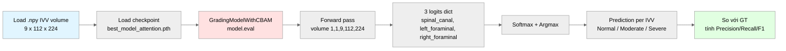

# Kiến trúc hệ thống

---

## 1. Data + Training Pipeline

**Note**: việc crop IVV dùng `train_label_coordinates.csv` (GT coords do RSNA cung cấp) giúp tách bạch bài toán grading khỏi detection — đánh giá được sạch chất lượng grading model.

---

## 2. Model architecture: GradingModelWithCBAM

```mermaid
%%{init: {'theme':'neutral'}}%%
flowchart LR
    IN[Input IVV volume<br/>1 x 9 x 112 x 224] --> C1[Conv3D 1 to 64<br/>k=3x7x7, stride=1x2x2]
    C1 --> BN[BatchNorm3D + ReLU]
    BN --> MP[MaxPool3D]
    MP --> L1[Layer1<br/>3 x BasicBlock<br/>64 channels]

    L1 --> CB1[CBAM1<br/>64 ch]
    CB1 --> L2[Layer2<br/>4 x BasicBlock<br/>128 channels]

    L2 --> CB2[CBAM2<br/>128 ch]
    CB2 --> L3[Layer3<br/>6 x BasicBlock<br/>256 channels, stride=2]

    L3 --> CB3[CBAM3<br/>256 ch]
    CB3 --> L4[Layer4<br/>3 x BasicBlock<br/>512 channels, stride=2]

    L4 --> CB4[CBAM4<br/>512 ch]
    CB4 --> GAP[GlobalAvgPool3D<br/>+ flatten]

    GAP --> H1[fc_spinal_canal<br/>Linear 512 to 3]
    GAP --> H2[fc_left_foraminal<br/>Linear 512 to 3]
    GAP --> H3[fc_right_foraminal<br/>Linear 512 to 3]

    H1 --> O1[3 logits<br/>Normal/Moderate/Severe]
    H2 --> O2[3 logits<br/>Normal/Moderate/Severe]
    H3 --> O3[3 logits<br/>Normal/Moderate/Severe]

    style IN fill:#e1f5ff
    style CB1 fill:#ffe1e1
    style CB2 fill:#ffe1e1
    style CB3 fill:#ffe1e1
    style CB4 fill:#ffe1e1
    style O1 fill:#e1ffe1
    style O2 fill:#e1ffe1
    style O3 fill:#e1ffe1
```

**Improvement**: 4 module CBAM (hộp màu đỏ) gắn sau mỗi ResNet stage. Backbone và head giữ như baseline, CBAM là phần thêm.

---

## 3. CBAM module internal

**Ý nghĩa**:
- **Channel Attention** trả lời câu hỏi **"feature channel nào quan trọng"** (vd: channel detect cạnh xương quan trọng hơn channel random noise)
- **Spatial Attention** trả lời câu hỏi **"vị trí không gian nào quan trọng"** (vd: vùng quanh IVV quan trọng hơn vùng bên ngoài)

---

## 4. Inference Pipeline (Evaluation)

> Input là file `.npy` đã được crop sẵn từ bước preprocessing (dùng GT coords), cùng format với lúc training.

**Quy trình**:
1. Load `.npy` volume từ `rsna_preprocessed/volumes/` (đã crop sẵn bằng GT coords trong preprocessing — giống training).
2. Load checkpoint + `model.eval()` (disable dropout, freeze BN statistics).
3. Forward pass → 3 logits cho 3 condition.
4. Softmax + Argmax → class (Normal / Moderate / Severe).
5. So với GT label trong `train_metadata.csv` → tính per-class Precision / Recall / F1.

---

## 5. Kết quả

Đánh giá per-IVV trên RSNA 2024 val set (~9700 IVV samples mỗi condition, 20% held-out, seed=42). So sánh baseline (chỉ train 3 heads mới, CE Loss) với cải tiến (CBAM + Focal Loss, train CBAM + 3 heads).

### 5.1 Spinal Canal Stenosis

| Variant | Overall Acc | Severe Recall | Severe F1 | Macro F1 |
|---|---|---|---|---|
| Baseline (ResNet34, CE) | **88.78%** | 31.2% | 40.8% | 46.6% |
| + CBAM + Focal (ours) | 85.23% | **83.5%** | **51.2%** | **59.1%** |

### 5.2 Left Foraminal Narrowing

| Variant | Overall Acc | Severe Recall | Severe F1 | Macro F1 |
|---|---|---|---|---|
| Baseline (ResNet34, CE) | **78.18%** | 0.0% | 0.0% | 37.9% |
| + CBAM + Focal (ours) | 58.15% | **42.3%** | **27.1%** | **46.0%** |

### 5.3 Right Foraminal Narrowing

| Variant | Overall Acc | Severe Recall | Severe F1 | Macro F1 |
|---|---|---|---|---|
| Baseline (ResNet34, CE) | **78.55%** | 0.0% | 0.0% | 38.2% |
| + CBAM + Focal (ours) | 64.11% | **31.1%** | **26.8%** | **48.9%** |

### 5.4 Nhận xét

- **Severe Recall tăng mạnh trên cả 3 condition**: 0% → 42.3% (LF), 0% → 31.1% (RF), 31.2% → 83.5% (SC). Đây là đóng góp lâm sàng chính — model không bỏ sót ca nặng.
- **Overall Accuracy giảm**: do model không còn collapse sang lớp Normal/Mild. Trong bài toán sàng lọc y tế, trade-off này hợp lý: **ưu tiên không bỏ sót ca nặng hơn là accuracy tổng thể**.
- **Macro F1 tăng đều cả 3 condition**: 46.6% → 59.1% (SC), 37.9% → 46.0% (LF), 38.2% → 48.9% (RF) → chứng tỏ cải tiến có giá trị thực sự, không chỉ shift accuracy qua lớp khác.
- **Spinal Canal cải thiện nhiều nhất** vì lớp Severe ở đây có support lớn hơn (468 samples vs 379-397 cho foraminal), Focal Loss học được tốt hơn.

---

## Glossary nhanh

| Thuật ngữ | Ý nghĩa |
|---|---|
| **IVV** | Intervertebral Disc — đĩa đệm giữa hai đốt sống |
| **Stage** | Một cụm BasicBlock trong ResNet (Layer1-4) |
| **Head** | Lớp Linear cuối cùng output class logits |
| **CBAM** | Convolutional Block Attention Module (Woo et al., ECCV 2018) |
| **Focal Loss** | Loss function giảm weight cho example dễ, tăng weight example khó (Lin et al., ICCV 2017) |
| **Uncertainty Loss** | Multi-task weighting tự động qua tham số σ learnable (Kendall et al., 2018) |
| **ANY-rule** | Bệnh nhân positive nếu BẤT KỲ level nào positive |
| **Linear Probe** | Transfer learning: freeze backbone, chỉ train classifier head mới |

---

