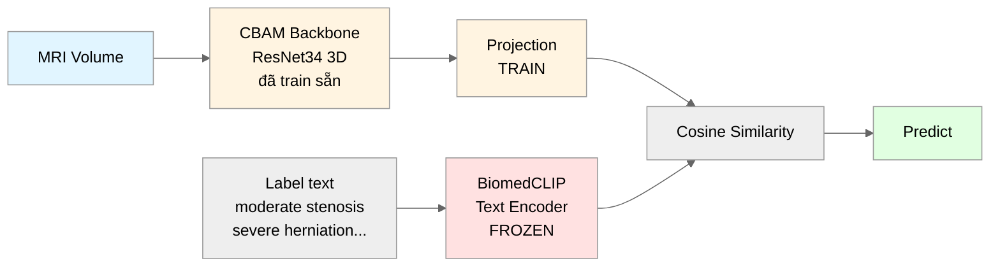

# Kiến trúc High-Level — SpineNetV2 + CBAM + BiomedCLIP

## Overview

## Giải thích 3 phần

| Màu | Phần | Vai trò |
|---|---|---|
| 🟡 Vàng | **CBAM Backbone + Projection** | CBAM: em đã train sẵn, giữ nguyên. Projection: 1 Linear(512→512) nhỏ, train thêm để "phiên dịch" image feature sang không gian của BiomedCLIP text. |
| 🔴 Đỏ | **BiomedCLIP Text Encoder** | Mới thêm, FROZEN (không train). Encode label text thành embedding có semantic. |
| 🟢 Xanh lá | **Output** | Predict label có cosine similarity cao nhất. |

## Projection layer là gì?

Projection là 1 `nn.Linear(512, 512)` (~262K params), đóng vai trò **cầu nối** giữa 2 không gian vector:

- **CBAM output**: vector 512-dim trong "không gian CBAM" (trained trên RSNA)
- **BiomedCLIP output**: vector 512-dim trong "không gian BiomedCLIP" (pretrained PubMed)

2 vector này **không so trực tiếp được** vì 2 model train độc lập. Projection **dịch** image feature sang không gian BiomedCLIP để cosine similarity có ý nghĩa.

**Train projection**:
- Chỉ ~262K params (0.2% tổng số params) — rất nhẹ
- Train qua contrastive loss: cặp (ảnh, label đúng) → kỳ vọng similarity cao nhất
- Thời gian: vài giờ GPU là đủ converge

## Key points cho thầy

1. **Giữ toàn bộ CBAM + Focal Loss** em đã làm (công không bỏ đi)
2. **Thay 3 Linear head cố định** bằng cơ chế cosine similarity với BiomedCLIP text embedding
3. **BiomedCLIP frozen** (không train) nên tránh catastrophic forgetting
4. **Label mới = chỉ cần text prompt**, không cần add layer mới và không cần retrain
5. **Projection layer nhỏ (~262K params)** là phần DUY NHẤT train mới, chi phí thấp
