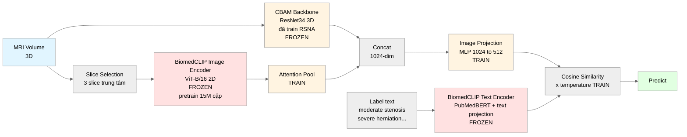

# Kiến trúc High-Level — SpineNetV2 + CBAM + BiomedCLIP (Hybrid)

> Revised 2026-04-24 theo feedback thầy:
> 1. **Thêm BiomedCLIP Image Encoder** (không lãng phí image side của BiomedCLIP)
> 2. **Show rõ text projection** đã pretrain internal (frozen, không train thêm)

---

## Overview — Hybrid Dual-Encoder



---

## Giải thích từng phần

| Màu | Phần | Vai trò |
|---|---|---|
| 🟡 Vàng | **CBAM Backbone (FROZEN)** | 3D ResNet34 + CBAM, em đã train sẵn trên RSNA. Cung cấp **feature spine-specific** + **3D spatial context** đầy đủ. Không train lại. |
| 🔴 Đỏ | **BiomedCLIP Image Encoder (FROZEN)** | ViT-B/16 2D, pretrain 15M cặp PubMed. Cung cấp **medical generic feature** → quan trọng cho zero-shot nhãn mới (biết herniation, spondylolisthesis, modic changes, ...). Không train. |
| 🟡 Vàng | **Attention Pool + Image Projection (TRAIN)** | Pool 3 slice features từ BiomedCLIP 2D, rồi MLP 1024→512 để fuse CBAM (512) + BiomedCLIP pooled (512). Đây là **phần duy nhất train ở image side** (~500K params). |
| 🔴 Đỏ | **BiomedCLIP Text Encoder (FROZEN)** | PubMedBERT + text projection head, cả 2 đã pretrain trên 15M cặp (giữ frozen). Encode label text thành embedding có semantic trong cùng không gian với image. **Không add projection trainable mới ở text side** vì sẽ phá vỡ zero-shot capability. |
| 🟢 Xanh lá | **Output** | Cosine similarity × temperature → argmax → predict label. |

---

## 2 feedback của thầy đã address

### Feedback 1: "BiomedCLIP có image encoder, em double check lợi thế CBAM, nếu cần hybrid"

**Đã address bằng Hybrid dual-encoder**:

| Encoder | Mang gì | Frozen? |
|---|---|---|
| **CBAM 3D** | Spine-specific, 3D native, Severe recall (em đã tune) | ✅ Frozen |
| **BiomedCLIP Image 2D** | Medical generic từ 15M cặp → zero-shot bệnh mới | ✅ Frozen |

→ **Bổ sung lẫn nhau**, không thay thế. Fusion layer học cách balance 2 path tùy nhãn.

### Feedback 2: "Text encoder cũng có projection head, sao hình chỉ có projection cho image"

**Đã show rõ trong diagram**:

```
BiomedCLIP Text Encoder
= PubMedBERT backbone + text projection head
  (cả 2 đã pretrain cùng image side trên 15M cặp, giữ FROZEN)
```

**Tại sao không add trainable projection mới ở text side**:
- BiomedCLIP text projection (internal) đã đưa text vào không gian shared với image
- Nếu em train projection text mới → overfit 9 RSNA label → **mất zero-shot cho nhãn mới**
- Đây là **design choice intentional** để preserve zero-shot capability (Level 1 thầy đòi)

---

## Trainable vs Frozen (tổng quan)

| Component | Params | Status |
|---|---|---|
| CBAM 3D backbone | ~22M | **FROZEN** |
| BiomedCLIP Image Encoder | ~86M | **FROZEN** |
| BiomedCLIP Text Encoder + text projection | ~110M | **FROZEN** |
| **Attention Pool (3 slices)** | **~1K** | **TRAIN** |
| **Image Projection MLP 1024→512** | **~500K** | **TRAIN** |
| **Temperature scale (logit_scale)** | **1** | **TRAIN** |
| **Total trainable** | **~500K** | **~0.3% tổng params** |

→ Pipeline cực nhẹ về training cost, reuse hoàn toàn knowledge của BiomedCLIP và CBAM.

---

## Tại sao pipeline này tận dụng được BiomedCLIP

**Sức mạnh BiomedCLIP nằm trong weights** (đã học từ 15M cặp):
- Image Encoder weights → biết medical image patterns
- Text Encoder weights → biết semantic của medical vocabulary
- Shared 512-dim space → image và text aligned

Em giữ **cả 3 component frozen** → inherit 100% kiến thức 15M cặp.

Em chỉ train **projection bridge** để plug CBAM feature vào không gian BiomedCLIP (vì CBAM không pretrain trong không gian đó).

---

## Key points cho thầy

1. **Giữ toàn bộ CBAM + Focal Loss** em đã làm (công không bỏ đi — frozen reuse)
2. **Thêm BiomedCLIP Image Encoder** để tận dụng full BiomedCLIP (không chỉ text)
3. **Fusion layer trainable** cho phép model học cách balance CBAM vs BiomedCLIP tùy nhãn
4. **Text encoder + text projection frozen** → preserve zero-shot cho nhãn mới (Level 1)
5. **Label mới = chỉ cần text prompt** (không cần retrain, không cần layer mới)
6. **Chỉ ~500K params trainable** (0.3%) → chi phí cực thấp, train nhanh

---

## Precedent

- **Hybrid encoder (foundation model + domain-specific)**: standard trong medical VLM literature (Lian et al. Sci Reports 2026, Wang et al. MedCLIP 2022)
- **2D encoder cho 3D data qua slice selection**: Lian et al. 2026 đã demo trên medical volume, train ~2 ngày trên 4×A800
- **Frozen text + trainable image projection**: CLIP zero-shot protocol chuẩn (Radford et al. 2021)
