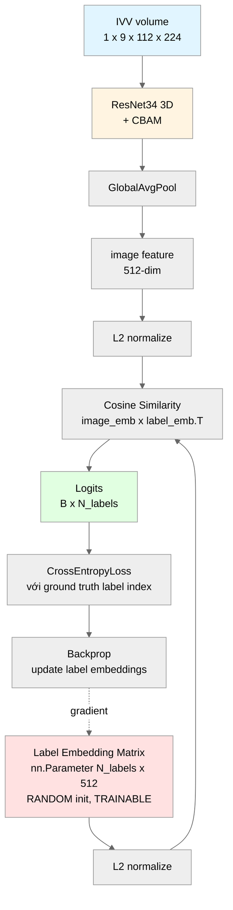
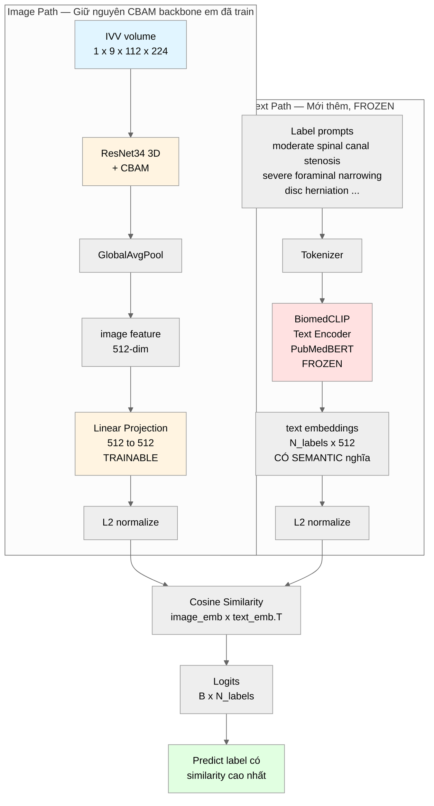
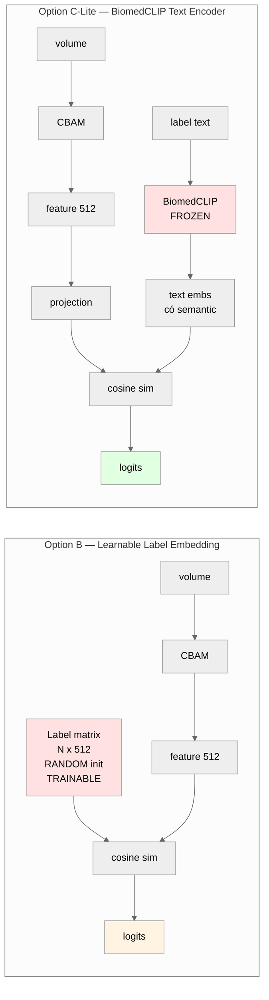

# Option B vs Option C — Kiến trúc so sánh chi tiết

> 2 option đáp ứng yêu cầu của thầy về label space scalability. Mỗi option có trade-off riêng về độ phức tạp và khả năng zero-shot.

---

## Option B — Learnable Label Embedding

### Kiến trúc



### Giải thích Option B

**Ý tưởng cốt lõi**: Thay 3 classification head cố định bằng **1 matrix tham số** `[N_labels, 512]`. Mỗi row của matrix đại diện cho **1 label** trong không gian 512-dim.

**Trainable**:
- `label_embeddings`: ~4.6K params (9 labels × 512) — **học qua training**
- `temperature`: 1 param scale

**Frozen**: không có phần nào frozen bản chất, nhưng CBAM backbone có thể đã được pretrained.

### Flow forward

1. Image → backbone + CBAM → feature 512-dim → normalize
2. Mỗi row của `label_embeddings` đã được normalize
3. Cosine similarity: `image_emb @ label_emb.T` → logits
4. Argmax → label có score cao nhất

### Khi thêm label mới

```python
# Label mới = row mới random, chưa học gì
new_label_row = torch.randn(1, 512)
label_embeddings = torch.cat([label_embeddings, new_label_row], dim=0)

# Output similarity với label mới = RANDOM
# Phải TRAIN trên data có label mới thì mới học được meaning
```

**Cần EWC hoặc LwF để khi train label mới không quên label cũ** (continual learning).

### Ưu / Nhược

| Ưu | Nhược |
|---|---|
| Code đơn giản (1 matrix param) | Label mới = random init, **KHÔNG zero-shot được** |
| Không phụ thuộc model ngoài | Cần train thêm mỗi khi có label mới |
| Train nhanh, GPU ít | Chỉ đáp ứng **Level 2** của thầy (incremental) |
| Giữ nguyên CBAM | Không support **Level 1** (zero-shot) |

### Đáp ứng thầy

- ✅ **Level 2** — Incremental learning (với EWC/LwF fallback)
- ❌ **Level 1** — Zero-shot label chưa thấy

---

## Option C-Lite — CBAM + BiomedCLIP Text Encoder

### Kiến trúc



### Giải thích Option C-Lite

**Ý tưởng cốt lõi**: Dùng **BiomedCLIP text encoder** (đã pretrain trên 15M cặp ảnh-text y khoa) để encode **label text** thành embedding **có ý nghĩa semantic**. Image feature (từ CBAM) được project vào cùng không gian để so similarity.

**Trainable**:
- `image_projection`: ~260K params (Linear 512→512) — align image vào text space
- `temperature`: 1 param
- (Optional) `CBAM backbone` với LoRA: ~1-2M params nếu muốn fine-tune thêm

**Frozen**:
- `BiomedCLIP text encoder`: ~110M params — **không train**, đã có semantic từ pretrain
- `CBAM backbone`: có thể giữ frozen (reuse checkpoint cũ) hoặc LoRA fine-tune

### Flow forward

1. **Offline (1 lần)**: Encode tất cả label text qua BiomedCLIP text encoder → save `.pt` file
2. Image → CBAM backbone → 512-dim → projection → normalize
3. Load pre-computed text embeddings (normalize)
4. Cosine similarity → logits → argmax

### Khi thêm label mới (Zero-shot!)

```python
# Label mới: "moderate disc herniation at L4/L5"
new_text = "a magnetic resonance image showing moderate disc herniation at L4 L5"

# Encode qua BiomedCLIP frozen (KHÔNG train gì)
new_emb = biomedclip_text_encoder(new_text)  # shape [1, 512]
new_emb = F.normalize(new_emb, dim=-1)

# Append vào label embeddings
label_embeddings = torch.cat([label_embeddings, new_emb], dim=0)

# LÚC NÀY MODEL ĐÃ CÓ THỂ PREDICT LABEL MỚI
# Không cần train thêm vì BiomedCLIP đã biết semantic của "disc herniation"
```

**Tại sao hoạt động**: BiomedCLIP đã học quan hệ giữa 15M cặp (ảnh, caption) y khoa. Nó biết:
- "moderate" gần "mild" / "severe" (mức độ)
- "disc herniation" gần "disc pathology" / "spinal lesion"
- "L4/L5" là một level của lumbar spine

→ Vector embedding của label mới được **đặt đúng vị trí semantic** trong không gian 512-dim, kể cả model chưa bao giờ thấy label đó.

### Ưu / Nhược

| Ưu | Nhược |
|---|---|
| **Zero-shot label mới thực sự** (Level 1) | Phụ thuộc BiomedCLIP model |
| Không catastrophic forgetting | Cần download ~500MB weights |
| Giữ toàn bộ CBAM em đã train | Code phức tạp hơn Option B |
| Paper value cao (cite được paper SOTA) | Accuracy zero-shot có thể thấp hơn supervised |
| Precedent: Lian et al. Sci Reports 2026 | Align CBAM feature với text space cần careful tuning |

### Đáp ứng thầy

- ✅ **Level 1** — Zero-shot label chưa thấy bao giờ
- ✅ **Level 2** — Incremental learning tự động (không cần thuật toán EWC/LwF)

---

## Side-by-side comparison



---

## Bảng so sánh quyết định

| Tiêu chí | Option B | Option C-Lite |
|---|---|---|
| **Đáp ứng Level 1 (zero-shot)** | ❌ Không | ✅ Có |
| **Đáp ứng Level 2 (incremental)** | ✅ Có (cần EWC) | ✅ Có (tự động) |
| Độ phức tạp code | Đơn giản | Trung bình |
| Phụ thuộc model ngoài | Không | Có (BiomedCLIP ~500MB) |
| Thời gian implement | ~2 tuần | ~2 tuần (tight) |
| GPU yêu cầu | 4090/5090 OK | 4090/5090 OK |
| Training time | ~10-15 giờ | ~15-20 giờ |
| Paper value | Trung bình | **Cao** (novelty + cite paper 2026) |
| Rủi ro technical | Thấp | Trung bình (alignment) |
| Giữ được CBAM cũ | ✅ | ✅ (reuse checkpoint) |

---

## Key takeaway

**Option B** là **safer** nhưng **chỉ đáp ứng 1/2 yêu cầu thầy** (Level 2 only). Nếu thầy ok với subset này → Option B.

**Option C-Lite** đáp ứng **cả 2 level** + paper value cao hơn + có precedent từ paper Sci Reports 2026 (Lian et al.). Rủi ro cao hơn nhưng manageable trong 2 tuần với hardware em có (4090/5090) + Claude Code support.

**Recommend cho thesis + paper**: **Option C-Lite** nếu thầy chấp nhận risk → đổi lấy paper stronger + đáp ứng đầy đủ yêu cầu thầy.
