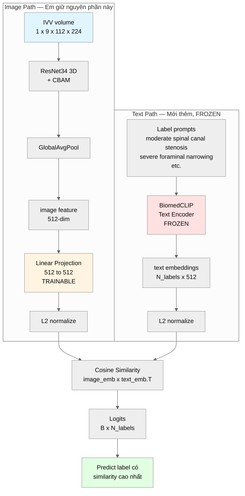
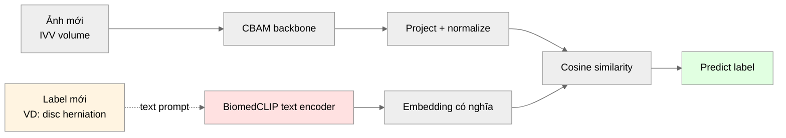
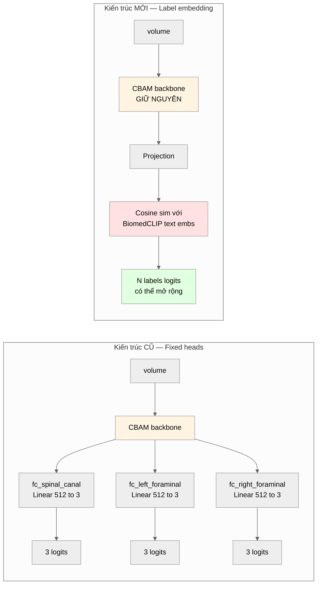

# Option C-Lite — CBAM + BiomedCLIP Text Encoder

## Kiến trúc tổng quan

```mermaid
%%{init: {'theme':'neutral'}}%%
flowchart TB
    subgraph IMG [Image Path — Em giữ nguyên phần này]
        V[IVV volume<br/>1 x 9 x 112 x 224] --> B[ResNet34 3D<br/>+ CBAM]
        B --> P1[GlobalAvgPool]
        P1 --> F1[image feature<br/>512-dim]
        F1 --> PROJ[Linear Projection<br/>512 to 512<br/>TRAINABLE]
        PROJ --> N1[L2 normalize]
    end

    subgraph TXT [Text Path — Mới thêm, FROZEN]
        T[Label prompts<br/>moderate spinal canal stenosis<br/>severe foraminal narrowing<br/>etc.] --> BMC[BiomedCLIP<br/>Text Encoder<br/>FROZEN]
        BMC --> F2[text embeddings<br/>N_labels x 512]
        F2 --> N2[L2 normalize]
    end

    N1 --> SIM[Cosine Similarity<br/>image_emb x text_emb.T]
    N2 --> SIM

    SIM --> L[Logits<br/>B x N_labels]
    L --> OUT[Predict label có<br/>similarity cao nhất]

    style V fill:#e1f5ff
    style BMC fill:#ffe1e1
    style PROJ fill:#fff4e1
    style OUT fill:#e1ffe1
```

---

## Flow zero-shot inference

```mermaid
%%{init: {'theme':'neutral'}}%%
flowchart LR
    A[Ảnh mới<br/>IVV volume] --> B[CBAM backbone]
    B --> C[Project + normalize]
    
    D[Label mới<br/>VD: disc herniation] -.text prompt.-> E[BiomedCLIP text encoder]
    E --> F[Embedding có nghĩa]
    
    C --> G[Cosine similarity]
    F --> G
    G --> H[Predict label]

    style D fill:#fff4e1
    style E fill:#ffe1e1
    style H fill:#e1ffe1
```

---

## So sánh kiến trúc cũ vs mới

```mermaid
%%{init: {'theme':'neutral'}}%%
flowchart LR
    subgraph OLD [Kiến trúc CŨ — Fixed heads]
        V1[volume] --> B1[CBAM backbone]
        B1 --> H1[fc_spinal_canal<br/>Linear 512 to 3]
        B1 --> H2[fc_left_foraminal<br/>Linear 512 to 3]
        B1 --> H3[fc_right_foraminal<br/>Linear 512 to 3]
        H1 --> O1[3 logits]
        H2 --> O2[3 logits]
        H3 --> O3[3 logits]
    end

    subgraph NEW [Kiến trúc MỚI — Label embedding]
        V2[volume] --> B2[CBAM backbone<br/>GIỮ NGUYÊN]
        B2 --> P[Projection]
        P --> S[Cosine sim với<br/>BiomedCLIP text embs]
        S --> O4[N labels logits<br/>có thể mở rộng]
    end

    style B1 fill:#fff4e1
    style B2 fill:#fff4e1
    style S fill:#ffe1e1
    style O4 fill:#e1ffe1
```
