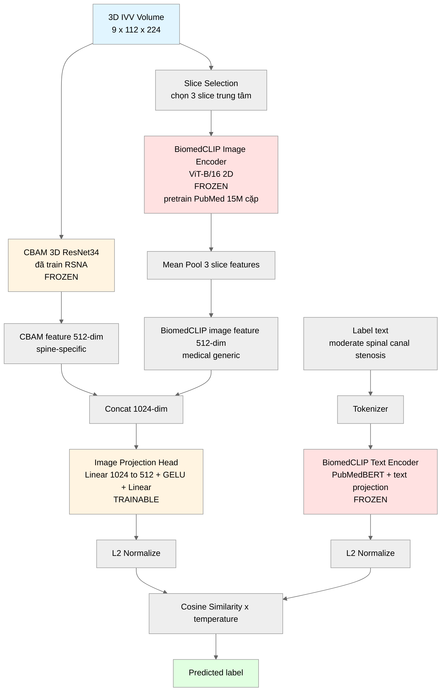
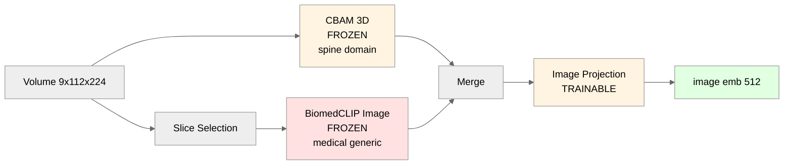
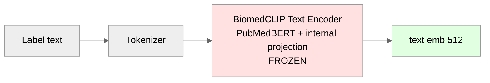
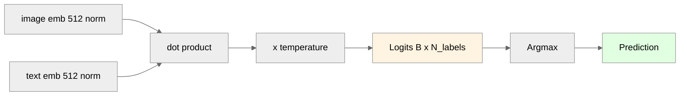
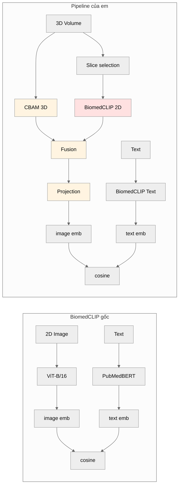

# Pipeline Revised — Hybrid CBAM + BiomedCLIP

> Revised sau feedback thầy Nhan Phan (2026-04-21). Thay đổi chính so với version trước:
> 1. Thêm BiomedCLIP image encoder (không chỉ text encoder)
> 2. Show rõ text projection (đã có trong BiomedCLIP, frozen)
> 3. Hybrid 2 image encoder với fusion layer → contribution rõ ràng hơn

---

## 1. Kiến trúc đầy đủ (Hybrid Dual-Encoder)

---

## 2. 3 phần chính của pipeline

### Phần A — Image Path (Hybrid Dual-Encoder)

**Đóng góp mới**: hybrid 2 encoder — CBAM spine-specific + BiomedCLIP medical generic → feature giàu hơn BiomedCLIP gốc.

---

### Phần B — Text Path (giữ nguyên BiomedCLIP)

**Lưu ý**: BiomedCLIP text encoder đã có text projection internal (đã pretrain). Em không add projection trainable ở text side vì:
- Text encoder đã frozen (không đổi qua training)
- Projection internal đã đủ để đưa text vào không gian chung với image

---

### Phần C — Alignment (cosine similarity scaled)

**Same as BiomedCLIP inference**. Khi argmax → label có similarity cao nhất.

---

## 3. Trainable vs Frozen

| Component | Params | Train hay Frozen? | Lý do |
|---|---|---|---|
| CBAM 3D ResNet34 | ~22M | **Frozen** | Đã train RSNA tốt, không muốn destroy |
| BiomedCLIP Image Encoder | ~86M | **Frozen** | Pretrain 15M cặp, không touch |
| BiomedCLIP Text Encoder | ~110M | **Frozen** | Pretrain 15M cặp, không touch |
| **Image Projection Head** | **~500K** | **TRAINABLE** | Học cách fuse + align 2 image feature |
| **Temperature scale** | **1** | **TRAINABLE** | Contrastive scaling |
| Total | ~218M | **0.2% trainable** | Rất nhẹ, train nhanh |

---

## 4. So sánh với BiomedCLIP gốc

**Khác biệt chính**:
- BiomedCLIP gốc: 1 image encoder 2D generic
- Pipeline em: 2 image encoder (spine-specific + generic) + fusion + 3D support

---

## 5. 4 Contribution của paper

1. **CBAM attention** cải thiện feature quality ở lớp Severe (từ công trước)
2. **Focal + Uncertainty Loss** xử lý class imbalance (từ công trước)
3. **Hybrid dual-encoder image path**: CBAM 3D + BiomedCLIP 2D, fusion trainable → **NOVEL**
4. **Zero-shot label extension** via BiomedCLIP text encoder frozen → **NOVEL**

---

## 6. Lợi thế của hybrid approach

| Scenario | BiomedCLIP gốc only | CBAM only | **Hybrid (em)** |
|---|---|---|---|
| Zero-shot label mới | ✅ | ❌ | ✅ |
| 3D native | ❌ (2D only) | ✅ | ✅ |
| Spine-specific attention | ❌ | ✅ | ✅ |
| Medical foundation knowledge | ✅ (15M pairs) | ❌ | ✅ |
| Severe recall recovery | ❌ | ✅ | ✅ |

→ **Hybrid có đủ 5/5 ưu điểm**.

---

## 7. Risks + Mitigation

| Risk | Mitigation |
|---|---|
| Fusion layer khó converge | 2-stage training: train projection first với features frozen, sau đó optional LoRA fine-tune |
| BiomedCLIP 2D slice aggregation mất 3D info | Slice selection chọn đúng slice có thông tin nhất (IVV center), giống Lian et al. 2026 |
| Zero-shot accuracy thấp trên 3D | Fallback: few-shot fine-tune projection với 10-20 sample |
| Scope tăng lên 3 tuần | Claude Code support + AI agents parallelize tasks |

---

## 8. Precedent justify approach

- **Hybrid encoder**: Fusion of foundation model + domain-specific encoder is standard in medical VLM literature (cite: Lian et al. 2026, Wang et al. MedCLIP 2022)
- **2D encoder cho 3D data**: Lian et al. 2026 đã demo BiomedCLIP 2D work cho 3D medical — trên 4 A800 chỉ mất ~2 ngày
- **Frozen text + trainable image projection**: Standard CLIP zero-shot protocol (Radford et al. 2021)

---

## Summary

Pipeline này giải quyết đủ 3 điểm feedback của thầy:

✅ **Thêm BiomedCLIP image encoder** — không lãng phí half của BiomedCLIP nữa  
✅ **Text projection rõ ràng** — đã show internal projection của BiomedCLIP text (frozen)  
✅ **Novelty rõ ràng** — hybrid dual-encoder là contribution original, không chỉ thay Linear head

Scope ước tính: **3 tuần** (thay vì 2 tuần) do thêm fusion module + ablation 3 variants (CBAM only / BiomedCLIP only / Hybrid).
