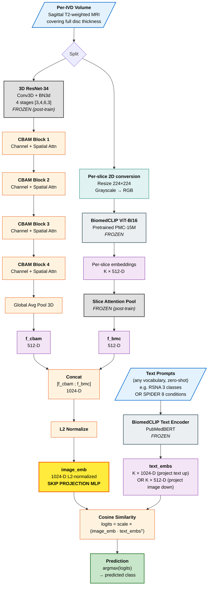
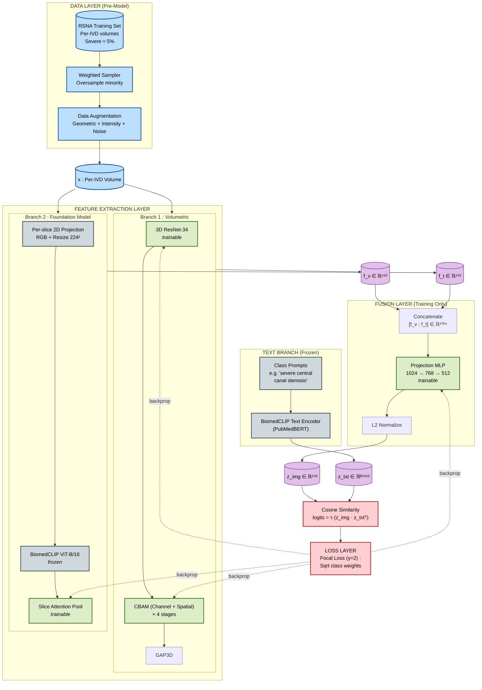
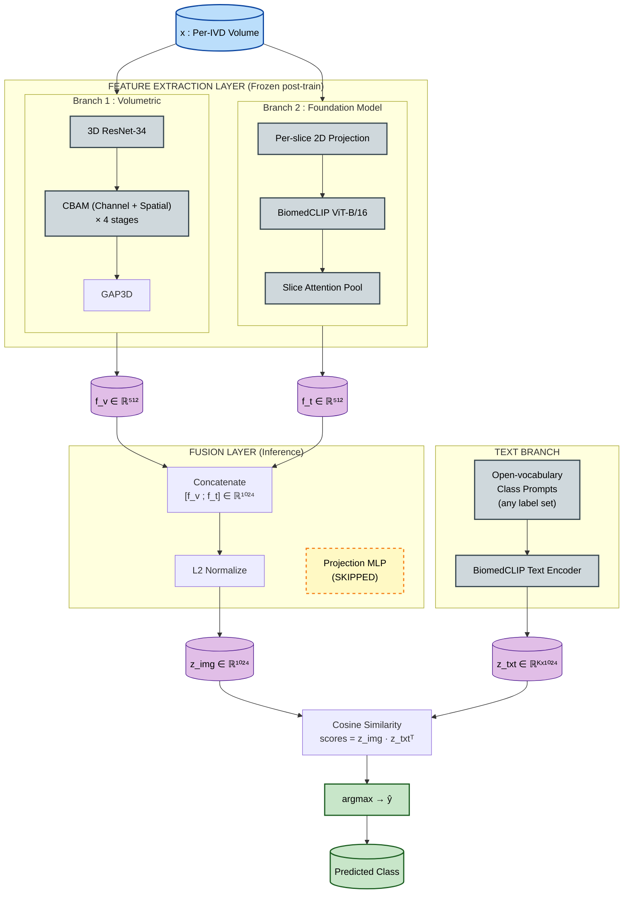

# Pipeline Diagrams — Training vs Inference

> 2 diagram tách riêng theo feedback thầy. Mở file này trong VS Code có
> Mermaid preview hoặc push GitHub để view.

---

## 1. Training Pipeline (có Projection MLP)

```mermaid
flowchart TB
    %% ===== DATA STAGE (TRƯỚC MODEL) =====
    Dataset[/"<b>RSNA Training Set</b><br/>~7700 IVD samples<br/>Severe ~5%, Mod ~10%, Normal/Mild ~85%"/]:::input
    Dataset --> Oversample["<b>① Oversampling Sampler</b><br/>Severe ×5, Moderate ×3<br/><i>Áp dụng tại DataLoader</i>"]:::imbalance
    Oversample --> Augment["<b>② Augmentation</b><br/>HFlip + L/R swap, Rotation ±10°<br/>Brightness/Contrast ±20%<br/>Gaussian noise σ=0.05<br/><i>Áp dụng cho mỗi sample</i>"]:::imbalance

    %% ===== INPUT VOLUME =====
    Augment --> Input[/"<b>Augmented Per-IVD Volume</b><br/>Sagittal T2-weighted MRI<br/>covering full disc thickness"/]:::input
    Input --> Split{Split}

    %% ===== CBAM BRANCH =====
    Split --> CBAMBackbone["<b>3D ResNet-34</b><br/>Conv3D + BN3d<br/>4 stages [3,4,6,3]<br/><i>TRAINABLE</i>"]:::trainable
    CBAMBackbone --> CBAM1["<b>CBAM Block 1</b><br/>Channel + Spatial Attn"]:::module
    CBAM1 --> CBAM2["<b>CBAM Block 2</b><br/>Channel + Spatial Attn"]:::module
    CBAM2 --> CBAM3["<b>CBAM Block 3</b><br/>Channel + Spatial Attn"]:::module
    CBAM3 --> CBAM4["<b>CBAM Block 4</b><br/>Channel + Spatial Attn"]:::module
    CBAM4 --> GAP["Global Avg Pool 3D"]:::module
    GAP --> FeatCBAM["<b>f_cbam</b><br/>512-D"]:::feat

    %% ===== BIOMEDCLIP BRANCH =====
    Split --> SliceTo2D["<b>Per-slice 2D conversion</b><br/>Resize 224×224<br/>Grayscale → RGB (repeat 3ch)<br/>Normalize"]:::preproc
    SliceTo2D --> BMCViT["<b>BiomedCLIP ViT-B/16</b><br/>Pretrained PMC-15M<br/><i>FROZEN</i>"]:::frozen
    BMCViT --> SliceEmbs["Per-slice embeddings<br/>K × 512-D"]:::feat
    SliceEmbs --> SlicePool["<b>Slice Attention Pool</b><br/>Softmax-weighted sum<br/><i>TRAINABLE</i>"]:::trainable
    SlicePool --> FeatBMC["<b>f_bmc</b><br/>512-D"]:::feat

    %% ===== FUSION =====
    FeatCBAM --> Concat["<b>Concat</b><br/>[f_cbam ; f_bmc]<br/>1024-D"]:::module
    FeatBMC --> Concat
    Concat --> MLP["<b>Projection MLP</b><br/>Linear 1024→768 + ReLU + Dropout<br/>Linear 768→512<br/><i>TRAINABLE</i><br/><b>ONLY IN TRAINING</b>"]:::trainable_highlight
    MLP --> L2norm["<b>L2 Normalize</b>"]:::module
    L2norm --> ImageEmb["<b>image_emb</b><br/>512-D L2-normalized"]:::feat

    %% ===== TEXT BRANCH =====
    TextPrompt[/"<b>Text Prompts</b><br/>'normal/mild stenosis at L4-L5'<br/>'moderate stenosis at L4-L5'<br/>'severe stenosis at L4-L5'"/]:::input
    TextPrompt --> BMCText["<b>BiomedCLIP Text Encoder</b><br/>PubMedBERT<br/><i>FROZEN</i>"]:::frozen
    BMCText --> TextEmb["<b>text_embs</b><br/>3 × 512-D"]:::feat

    %% ===== COSINE SIM =====
    ImageEmb --> CosineSim["<b>Cosine Similarity</b><br/>logits = scale × (image_emb · text_embsᵀ)"]:::module
    TextEmb --> CosineSim
    CosineSim --> Logits["Logits<br/>3-class"]:::feat

    %% ===== LOSS STAGE (SAU COSINE) =====
    Logits --> FocalLoss["<b>③ Focal Loss</b><br/>FL = -α(1-p_t)^γ × log(p_t)<br/>γ=2.0<br/><i>Down-weight easy samples</i>"]:::imbalance
    FocalLoss --> ClassWeight["<b>④ Sqrt Class Weight</b><br/>w_c = 1/√n_c<br/><i>Áp dụng vào gradient</i>"]:::imbalance
    ClassWeight --> Loss["<b>Total Loss</b><br/>Backprop to trainable params"]:::loss

    %% ===== STYLES =====
    classDef input fill:#e3f2fd,stroke:#1976d2,stroke-width:2px,color:#000
    classDef trainable fill:#c8e6c9,stroke:#2e7d32,stroke-width:2px,color:#000
    classDef trainable_highlight fill:#ffeb3b,stroke:#f57f17,stroke-width:3px,color:#000
    classDef frozen fill:#eceff1,stroke:#546e7a,stroke-width:2px,color:#000
    classDef module fill:#fff3e0,stroke:#e65100,stroke-width:1px,color:#000
    classDef feat fill:#f3e5f5,stroke:#7b1fa2,stroke-width:1px,color:#000
    classDef preproc fill:#e0f2f1,stroke:#00796b,stroke-width:1px,color:#000
    classDef loss fill:#ffcdd2,stroke:#c62828,stroke-width:2px,color:#000
    classDef imbalance fill:#ffe0b2,stroke:#bf360c,stroke-width:2px,color:#000
```



**4 thành phần xử lý imbalance (đánh số ①②③④ trong diagram)**:

| # | Thành phần | Vị trí trong pipeline | Tác dụng |
|---|---|---|---|
| ① | **Oversampling** | **DataLoader sampler** — TRƯỚC model | Tăng tần suất Severe/Moderate trong batch |
| ② | **Augmentation** | **Data transform** — TRƯỚC model | Tăng data diversity, giảm overfit |
| ③ | **Focal Loss** | **Loss function** — SAU cosine | Giảm gradient của easy samples |
| ④ | **Sqrt Class Weight** | **Loss function** — SAU cosine | Cân bằng gradient giữa các class |

→ **2 cái TRƯỚC model** (sampling + augmentation), **2 cái SAU model** (focal modulation + class weight).

**Chú thích màu**:
- 🟦 Input
- 🟩 Trainable component (CBAM-3D, SliceAttentionPool, Projection MLP)
- 🟨 **Projection MLP — chỉ dùng trong TRAINING**
- ⬜ Frozen component (BiomedCLIP image + text encoders)
- 🟧 Operation (concat, pool, norm)
- 🟪 Feature vector
- 🟦 Preprocessing
- 🟥 Loss

**Trainable params**: ~1.18M (CBAM fine-tune + Slice Pool + Projection MLP)
**Total params**: ~218M (chủ yếu frozen)

---

## 2. Inference Pipeline (KHÔNG có Projection MLP)



**Chú thích màu** (inference):
- 🟦 Input
- ⬜ Frozen (BiomedCLIP) — luôn frozen
- ⬛ Frozen post-training (CBAM-3D + SliceAttentionPool) — đã train xong, lock lại
- 🟧 Operation
- 🟪 Feature vector
- 🟨 **image_emb (skip projection MLP)** — điểm khác training
- 🟩 Output (prediction)

**Inference time**: ~9.65 ms/sample (RTX 4090)
**Throughput**: 103 sample/s

---

## 3. Diagram tổng quan SpineNetV2 + BiomedCLIP Pipeline

```mermaid
flowchart LR
    %% ===== PHASE 1: UPSTREAM SPINENETV2 =====
    Raw[/"Raw Sagittal T2<br/>Lumbar MRI<br/>(multi-slice DICOM)"/]:::input
    Raw --> VBDetect["<b>VB Detector</b><br/>(SpineNetV2)<br/>Vertebra body detection"]:::spinenet
    VBDetect --> Keypoint["<b>Keypoint Annotation</b><br/>5 IVD centers<br/>(L1-L2 → L5-S1)"]:::feat
    Keypoint --> Crop["<b>Per-IVD Volume Extraction</b><br/>Sagittal volumetric crop<br/>covering full disc thickness"]:::module

    %% ===== PHASE 2: OUR HYBRID =====
    Crop --> Hybrid["<b>Hybrid Model (OURS)</b><br/>CBAM-3D + BiomedCLIP"]:::ours
    
    Hybrid --> CBAM["CBAM-3D ResNet-34<br/><i>trainable</i>"]:::trainable
    Hybrid --> BMC["BiomedCLIP ViT-B/16<br/><i>frozen, 2.5D</i>"]:::frozen
    
    CBAM --> Fusion["Concat + Projection MLP<br/>(training only)"]:::trainable
    BMC --> Fusion
    
    Fusion --> Cosine["Cosine Similarity<br/>vs Text Embeddings"]:::module

    %% ===== PHASE 3: OUTPUT =====
    Cosine --> Output{"<b>Output</b>"}:::output
    Output --> RSNA["<b>RSNA 3-class</b><br/>Normal/Mild, Moderate, Severe<br/>× 3 conditions × 5 levels"]:::output
    Output --> SPIDER["<b>SPIDER 8-label</b><br/>Zero-shot<br/>(Pfirrmann, Modic, ...)"]:::output

    %% ===== STYLES =====
    classDef input fill:#e3f2fd,stroke:#1976d2,stroke-width:2px,color:#000
    classDef spinenet fill:#bbdefb,stroke:#1565c0,stroke-width:2px,color:#000
    classDef trainable fill:#c8e6c9,stroke:#2e7d32,stroke-width:2px,color:#000
    classDef frozen fill:#eceff1,stroke:#546e7a,stroke-width:2px,color:#000
    classDef module fill:#fff3e0,stroke:#e65100,stroke-width:1px,color:#000
    classDef ours fill:#fff59d,stroke:#f57f17,stroke-width:3px,color:#000
    classDef feat fill:#f3e5f5,stroke:#7b1fa2,stroke-width:1px,color:#000
    classDef output fill:#c8e6c9,stroke:#2e7d32,stroke-width:2px,color:#000
```



---

## 4. Bảng tổng hợp Technical Modules

| Module | Vai trò | Trainable? | Khi nào active? |
|---|---|---|---|
| **3D ResNet-34** | Backbone xương sống (feature extractor 3D) | ✅ Yes (training) | Cả train + inference |
| **CBAM Channel Attention** | Channel-wise feature recalibration | ✅ Yes | Cả train + inference |
| **CBAM Spatial Attention** | Spatial localization | ✅ Yes | Cả train + inference |
| **Global Avg Pool 3D** | Reduce spatial → vector | ❌ No params | Cả train + inference |
| **BiomedCLIP ViT-B/16** | 2D image encoder (per-slice) | ❌ Frozen | Cả train + inference |
| **Slice Attention Pool** | Aggregate per-slice embeddings | ✅ Yes | Cả train + inference |
| **Projection MLP (1024→768→512)** | Fuse 2 branches into shared space | ✅ Yes | **⭐ TRAINING ONLY** |
| **L2 Normalize** | Unit-norm for cosine sim | ❌ No params | Cả train + inference |
| **BiomedCLIP Text Encoder** | Encode text prompts | ❌ Frozen | Cả train + inference |
| **Cosine Similarity** | Logits computation | ❌ No params | Cả train + inference |
| **Focal Loss + Class Weight** | Imbalanced training | — | Training only |
| **Oversampling** | Sampler-level minority boost | — | Training only |
| **Augmentation (HFlip, rotation, brightness, noise)** | Data variation | — | Training only |

---

## 5. System Architecture Diagram — English (for paper submission)

> Clean architecture-style diagrams in English, organized in layered
> blocks, suitable for conference paper figures (EMBC / MICCAI / ISBI).

### 5.1 Training Architecture



### 5.2 Inference Architecture (Projection MLP removed)



### 5.3 Notation reference

| Symbol | Meaning | Dimension |
|---|---|---|
| `x` | Input per-IVD volume | C × D × H × W |
| `f_v` | Volumetric (CBAM-3D) feature | ℝ⁵¹² |
| `f_t` | Foundation-model (BiomedCLIP) feature | ℝ⁵¹² |
| `z_img` | Final image embedding | ℝ⁵¹² (train) / ℝ¹⁰²⁴ (inference) |
| `z_txt` | Text-prompt embeddings | ℝᴷˣᴰ |
| `τ` | Learnable logit-scale (inverse temperature) | scalar |
| `K` | Number of class prompts | RSNA: 3 · SPIDER zero-shot: 8 |

### 5.4 Key design decisions to emphasize in paper

1. **Two-stream architecture**: Volumetric (3D-CNN with attention) + 2D Vision-Language stream.
2. **Asymmetric trainability**: Foundation model frozen, lightweight components (~1.18M params) trained.
3. **Late-fusion via Projection MLP**: Combines streams into shared embedding space during training.
4. **Open-vocabulary inference**: Cosine similarity with arbitrary text prompts enables zero-shot label-space extension.
5. **Imbalance-aware training**: Sampler-level (oversampling) and loss-level (focal + class-weight) techniques cooperate.

---

## 6. Cách xem diagram

### Option 1: VS Code
1. Install extension `Markdown Preview Mermaid Support` (Matt Bierner)
2. Mở file này → Cmd+Shift+V → preview

### Option 2: GitHub
- Push repo, mở file trên web → auto render

### Option 3: Mermaid Live Editor
- Copy mỗi block ```mermaid``` paste vào https://mermaid.live
- Export PNG/SVG để insert vào PowerPoint/LaTeX

### Option 4: Local browser
```bash
# Install mermaid-cli (nếu cần export PNG)
npm install -g @mermaid-js/mermaid-cli

# Export PNG
mmdc -i DIAGRAMS_PIPELINE.md -o diagrams.png
```
